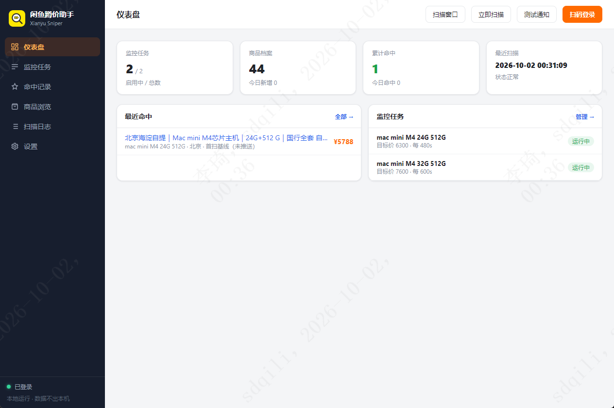

# xianyu-sniper（闲鱼蹲价助手）

一个本地优先的闲鱼好价监控工具：手动录入关键词与目标价，程序定时扫描闲鱼新上架商品，经「规则层 + AI 层（可选）」双层筛选后，把达标商品推送到自己的手机/IM。

> 定位：自用工具。借鉴 [ai-goofish-monitor](https://github.com/Usagi-org/ai-goofish-monitor)（SQLite 存储、登录态文件化、Web 管理界面、调度抖动）与 Xianyu-Supply-Monitor（搜索接口监听、规则筛选、多渠道通知）两个项目的已验证实践。

<!-- 主界面截图：截好后存为 docs/images/screenshot-main.png 即可 -->


## 核心特性

- 多关键词监控 + 每个关键词独立目标价（蹲好价核心）
- 双层筛选：规则层零成本过滤（去重/价格/包含排除词/地区），AI 层可开关（OpenAI 兼容接口）
- 内置有头浏览器扫码登录，登录态文件化，日常扫描 headless 运行
- 多渠道通知：Bark / Server 酱 / Telegram / 钉钉 / 通用 Webhook / Windows 桌面通知
- 本地 Web UI 管理任务、命中记录、扫描日志与配置
- 价格历史记录；登录态导入导出；Docker 一键迁移；多账号/代理预留

## 技术栈

Node.js 20+ / Playwright / better-sqlite3 / Fastify

## 文档索引

| 文档 | 内容 |
|---|---|
| [AGENTS.md](./AGENTS.md) | AI 协作规范、编码约定、文档留存与进度更新规则 |
| [docs/01-需求与方案.md](./docs/01-需求与方案.md) | 需求定义、项目对比借鉴、技术选型结论 |
| [docs/02-架构设计.md](./docs/02-架构设计.md) | 系统架构、数据模型、筛选管线、登录与防封设计 |
| [docs/03-里程碑与进度.md](./docs/03-里程碑与进度.md) | M1/M2/M3 计划、任务清单、进度日志（每次变更必须更新） |
| [docs/04-参考代码说明.md](./docs/04-参考代码说明.md) | `reference/` 目录代码来源与移植指引 |

## 快速开始（Windows）

### 方式一：发行版 exe（推荐）

到 [Releases](https://gitee.com/thymef/xianyu-sniper/releases) 下载：

| 文件 | 说明 |
|---|---|
| `xianyu-sniper-setup-*.exe` | 安装版，双击安装，从开始菜单/桌面启动 |
| `xianyu-sniper-portable-*.exe` | 免安装绿色版，双击即用 |

无需安装 Node.js 或浏览器（采集复用系统自带的 Edge/Chrome）。启动后自动打开控制台（默认 http://127.0.0.1:8787，被占用时自动顺延），数据与登录态存放在 `%APPDATA%\xianyu-sniper\`。

### 方式二：源码运行

前置：Node.js 20+。

```powershell
npm install
npm run electron   # 启动 Electron 桌面壳：调度器 + 控制台窗口 + 托盘常驻
```

<details>
<summary>纯命令行方式（无窗口，可选）</summary>

```powershell
Copy-Item config.example.json config.json   # 按需填写通知 Key / AI 配置
node src/index.js login                      # 扫码登录（也可在网页里扫）
node src/index.js add "iphone 15" --target 3500 --exclude "回收,换购"
node src/index.js run                        # 启动调度器 + Web 控制台
```

常用命令：`list` 列任务、`rm <id>` 删除、`enable/disable <id>` 启停、`run --once` 单轮扫描、`test-notify` 测试通知。
</details>

### 首次使用

1. 控制台右上角点「扫码登录」，在弹出的浏览器里扫码
2. 「监控任务」→ 新建任务：填关键词 + 目标价（可选包含词/排除词/价格区间）
3. 程序自动定时扫描，命中就推送到你配置的渠道；「商品浏览」可查看每条商品为什么命中/被过滤

## 目录结构

```text
xianyu-sniper/
├── AGENTS.md            # AI 协作与项目规范
├── README.md
├── build/               # 打包素材（icon.ico）
├── docs/                # 编号文档（方案/架构/进度/参考说明）
├── reference/           # 参考代码留存（Xianyu-Supply-Monitor 源码快照，只读）
├── scripts/             # 工具脚本（图标生成/打包/ABI 切换）
├── src/                 # 项目源码（web 控制台 / electron 壳 / 采集调度）
├── state/               # 登录态 storage_state（gitignore，不入库）
├── data/                # SQLite 数据文件（gitignore）
└── config.example.json  # 配置模板
```

## 合规提醒

仅用于个人低频提醒，请保持轮询间隔 ≥60 秒并尊重平台风控，禁止高频请求或批量抓取。
