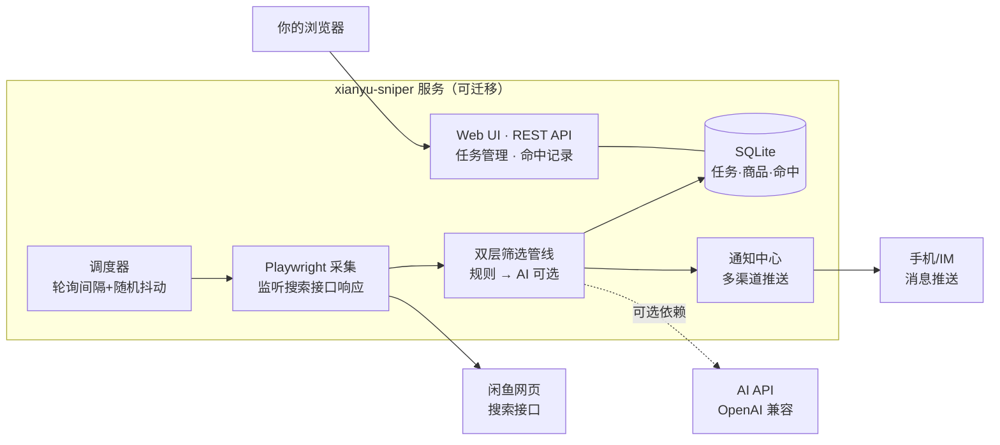
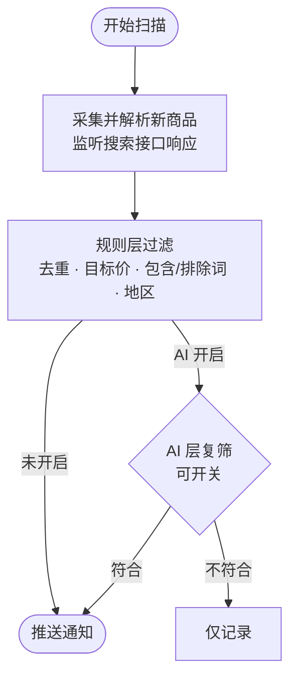

# 02 — 架构设计

> 状态：已确认（2026-10-01）。数据模型、筛选流程等方案变更须同步更新本文档。

## 1. 系统架构

虚线框内是一个普通 Node 服务进程，本机与服务器运行同一份代码（迁移只换运行方式）。



模块职责与源码位置：

| 模块 | 源码 | 职责 |
|---|---|---|
| 入口 | `src/index.js` | 启动调度器与 Web 服务，加载配置 |
| 调度器 | `src/scheduler.js` | 按 `watch_item.interval_sec` 轮询（≥60s）并加随机抖动；多关键词错峰 |
| 采集 | `src/capture/browser.js` `src/capture/search.js` | 管理 Playwright 上下文（headed 登录 / headless 扫描）；打开搜索页并监听搜索接口响应 |
| 解析 | `src/parse/parser.js` | 接口响应 JSON → 商品列表（自 `reference/xianyu-supply-monitor/xianyu-parser.js` 移植改造） |
| 规则层 | `src/filter/rule.js` | 去重 → 目标价/价格区间 → 包含词/排除词 → 地区过滤 |
| AI 层 | `src/filter/ai.js` | OpenAI 兼容调用，输出 `{match, reason}`；可开关，失败时降级为放行并记录日志 |
| 通知 | `src/notify/*` | 每渠道一个模块，统一 `notify(item)` 接口 |
| 存储 | `src/store/db.js` | better-sqlite3 初始化、建表、查询封装 |
| Web | `src/web/server.js` | Fastify REST API（`/api` 前缀）+ 静态管理页 |

## 2. 双层筛选管线



设计要点：

- **去重先行**：命中 `item` 表已有 `xianyu_id`（同一监控任务内）的直接跳过，零成本。
- **目标价（蹲好价核心）**：`price <= target_price` 才放行；`min_price` 用于过滤明显异常的低价引流。
- **价格区间服务端前置过滤**：任务的 `min_price/max_price` 会直接在搜索页价格筛选框填入（价格不走 URL 参数，页面把它写进接口请求体 `propValueStr.searchFilter = "priceRange:min,max;"`；接口有签名无法直接改请求，只能模拟用户输入这一真实路径）。服务端过滤后 **30 条配额全部落在区间内**，等效扩大覆盖；响应收集按请求体精确匹配完整区间参数，丢弃首屏/排序/填价中间态响应。规则层本地价格过滤保留作双保险（填框失败时兜底）。
- **词匹配约定**：包含/排除词忽略大小写；标题与描述拼接后一起参与匹配（很多卖家把配置写在描述里，且接口标题常被截断）。多词任一命中即视为命中（OR 语义）。
- **判定透明化**：每条商品的规则判定结果与原因写入 `item.filter_status/filter_reason`；每轮扫描的过滤明细写入 `scan_log.detail`，Web 端可逐条查看「为什么没命中」。旧数据由服务启动时自动回填。
- **降价重估**：已入库但从未推送过的商品，价格发生变化时重新过一遍规则；达标即推送「📉 降价达标」并标记 `notified_at`（蹲「等卖家降价」的核心场景，同一商品最多提醒一次）。
- **通知防骚扰**：
  - 同一商品一次达标只推一次（`notified_at` 一次性标记，之后价格再变也不重复推）；
  - **轮内聚合**：一轮扫描命中多条时合并为一条通知（标题带「N 条」，正文逐条列标题/价格/链接），单条命中保持原格式。
- **登录失效告警只推一次**：扫描捕获 `LOGIN_EXPIRED` 后删除登录态文件并推送「⚠️ 闲鱼登录态已失效」；推送过一次就不再重复（kv 标记 `loginExpiredNotified`），重新扫码登录成功后自动重置。页面侧边栏区分「未登录」（从未登录）与「登录已失效」（登录过但会话过期，kv 标记 `loginStateExpired`）。
- **AI 层旁路**：任务或全局关闭 AI 时走直通路径；调用失败视为「放行 + 记 warning 日志」，不阻断通知（可配置严格模式改为丢弃）。
- **AI Prompt 方向**：判断商品是否为关键词所指的完整正品（排除配件/空壳/引流）、描述是否清晰、价格是否合理；输入标题+描述+价格，起步用廉价文本模型，后续可升级多模态识图。

### 分发与打包计划

- 日常启动：双击 `start.bat`（自动装依赖、生成默认配置、启动并打开控制台），无需 npm 命令。
- 打包形态选型：因依赖 Playwright（原生模块 + 需要浏览器内核），`pkg`/Node SEA 单文件方案不可行；采用**便携包**方案——Node 便携版 zip + 项目源码 + `start.bat` 打成一个 zip，解压即用（`scripts/package.ps1` 一键生成）。
  - **全量版**（默认）：内置 `node_modules`（约 93MB），解压即用，零联网零 npm；`-Light` 参数出轻量版（首跑需联网 `npm install`）。
  - 启动器生成有两个编码坑（均已踩过）：bat 必须 **ANSI(GBK) 无 BOM** 写入（UTF-8 BOM 会让 cmd 首行报错闪退），且行尾必须 **CRLF**（LF-only 的 bat 括号块/标签解析错乱）。
- 对比参考：Xianyu-Supply-Monitor 的 exe 是 **Electron 打包**（自带 Chromium 内核 + `BrowserWindow` 原生窗口，故能双击 exe 且监控窗口天然可见）。我们用 Playwright + Node，体积与内存远小于 Electron，代价是没有「原生应用壳」，以便携包替代。
- **Electron 桌面壳**（`src/electron/main.js`，`npm run electron`）：补上「原生应用壳」的挂机体验，业务代码零改动——主进程直接复用全部 `src/`（Fastify 起在 `127.0.0.1:8787`，窗口 `loadURL` 本地服务；**端口顺延**：`startWebServer` 在首选端口被占（EADDRINUSE，残留实例或其他程序）时依次 +1 重试最多 10 个，返回实际端口供窗口/控制台 URL 使用；单实例锁防 Electron 自家双开，但外部程序占端口仍可被顺延绕开）：
  - 关窗 = 收进托盘继续监控（`appQuitting` 标志区分），真正退出走托盘菜单；
  - 托盘四态图标（**用户亲自设计的 SVG 源稿** `src/electron/assets/tray-design.svg`：圆角方块底板 + 放大镜 + 镜片内价格标签/降价箭头，`scripts/convert-tray-svg.js` 用 @resvg/resvg-js 栅格化 512px → 面积降采样 32px，同形换底板色：绿=运行已登录 / 黄=扫描（原稿配色）/ 红=登录失效 / 灰=已停止，标签主体恒黄）；5s 轮询 `scheduler.busy` + kv `loginStateExpired`，左键点托盘打开控制台（`scripts/gen-tray-icons.js` 程序化兜底、`convert-tray-jpg.js` 位图转换管线保留备用）；
  - 单实例锁防双开（双开 = 两个调度器轰炸闲鱼）；`before-quit` 停调度器并清理 Playwright 浏览器（防僵尸 Chrome）；
  - 外链（商品页）走系统浏览器；托盘菜单可选开机自启（`--hidden` 启动不弹窗）。
  - **ABI 双宿主约束**：better-sqlite3 是 V8-API 原生模块，Node 与 Electron 二进制不通用（`build/Release` 单槽位）。固定组合 **better-sqlite3 11.3.0 + electron 31**——两者的 node-v115 / electron-v125 prebuild 在 npmmirror 均有现成资产，无需本地编译（GitHub 直连在本环境不可靠；better-sqlite3 v13 需 Node≥22，v12 无 Node 20 prebuild，均不可用）。`npm run abi:node` / `npm run abi:electron` 一键切换（`scripts/abi-switch.js`：首次联网各下载一份存 `.bak`，之后本地互换秒切；切换前需停掉运行中的服务/Electron）。升级 Electron 大版本前先确认 npmmirror 有对应 ABI 的 better-sqlite3 prebuild。
  - **electron-builder 打包**（`npm run dist`，配置在 package.json `build` 字段）：产物 NSIS 安装器（`xianyu-sniper-setup-<v>.exe`，oneClick 当前用户级）+ portable 单文件 exe（免安装）；应用图标 `build/icon.ico` 由 `scripts/gen-app-icon.js` 从 tray-design.svg 渲染 256px PNG 内嵌 ICO（零依赖手写 ICO 容器）；`files` 仅收 `src/**` + 生产依赖（electron-builder 自动排除 devDependencies），better-sqlite3 原生模块 asarUnpack；下载二进制走 npmmirror 镜像（`ELECTRON_MIRROR` + `ELECTRON_BUILDER_BINARIES_MIRROR` 环境变量）；打包前需停掉运行中的 Electron 且 better-sqlite3 处于 **electron ABI**（打包进去的就是 node_modules 现状，不触发 rebuild）。
- Docker 部署：见仓库根 `Dockerfile` / `docker-compose.yml`（服务器场景，headless）。

## 3. 数据模型（SQLite，`data/app.db`）

```sql
CREATE TABLE IF NOT EXISTS watch_item (
  id            INTEGER PRIMARY KEY AUTOINCREMENT,
  keyword       TEXT NOT NULL,
  target_price  REAL,              -- 蹲守目标价，空则不按目标价过滤
  min_price     REAL,
  max_price     REAL,
  include_words TEXT,              -- 逗号/竖线分隔
  exclude_words TEXT,
  area_include  TEXT,
  area_exclude  TEXT,
  account       TEXT,              -- 多账号预留：对应 state/storage_state_<account>.json
  ai_enabled    INTEGER NOT NULL DEFAULT 0,
  interval_sec  INTEGER NOT NULL DEFAULT 120,
  enabled       INTEGER NOT NULL DEFAULT 1,
  created_at    TEXT NOT NULL DEFAULT (datetime('now','localtime'))
);

CREATE TABLE IF NOT EXISTS item (
  id             INTEGER PRIMARY KEY AUTOINCREMENT,
  watch_item_id  INTEGER NOT NULL REFERENCES watch_item(id) ON DELETE CASCADE,
  xianyu_id      TEXT NOT NULL,
  title          TEXT,
  descr          TEXT,
  price          REAL,
  area           TEXT,
  seller         TEXT,
  url            TEXT,
  image_url      TEXT,
  raw_json       TEXT,
  filter_status  TEXT,             -- 规则判定：hit=达标 / filtered=被过滤（NULL=旧数据未判定）
  filter_reason  TEXT,             -- 判定原因，页面透明化展示「为什么没命中」
  first_seen_at  TEXT NOT NULL DEFAULT (datetime('now','localtime')),
  ai_verdict     INTEGER,          -- 1 符合 / 0 不符合 / NULL 未走 AI
  ai_reason      TEXT,
  notified_at    TEXT,
  UNIQUE(watch_item_id, xianyu_id)
);

CREATE TABLE IF NOT EXISTS scan_log (
  id             INTEGER PRIMARY KEY AUTOINCREMENT,
  watch_item_id  INTEGER,
  started_at     TEXT NOT NULL DEFAULT (datetime('now','localtime')),
  status         TEXT NOT NULL,    -- ok / error
  new_count      INTEGER NOT NULL DEFAULT 0,
  detail         TEXT,             -- 本轮明细 JSON：{seen,dup,new,hits[],priceDrops,filtered[{title,price,reason}]}
  error          TEXT
);

CREATE TABLE IF NOT EXISTS config (
  key   TEXT PRIMARY KEY,
  value TEXT NOT NULL              -- JSON 字符串（通知渠道、AI Key 等）
);

CREATE TABLE IF NOT EXISTS price_history (
  id             INTEGER PRIMARY KEY AUTOINCREMENT,
  item_id        INTEGER NOT NULL REFERENCES item(id) ON DELETE CASCADE,
  watch_item_id  INTEGER NOT NULL,
  price          REAL,
  captured_at    TEXT NOT NULL DEFAULT (datetime('now','localtime'))
);

CREATE INDEX IF NOT EXISTS idx_item_watch ON item(watch_item_id, xianyu_id);
CREATE INDEX IF NOT EXISTS idx_price_history_item ON price_history(item_id, captured_at);
CREATE INDEX IF NOT EXISTS idx_scan_log_watch ON scan_log(watch_item_id, started_at);
```

> 注意：`config` 存 AI Key、推送 Token 等敏感信息，库文件在 `data/`（gitignore）。首次扫描基线策略沿用 Xianyu-Supply-Monitor：首扫只记 `seen` 不推送，可按任务配置「首扫也推送」。

### 数据保留与清理

- 单文件 SQLite（WAL 模式），全部数据在 `data/app.db`；`item.raw_json` 是占空间大头（每条商品完整接口 JSON）。
- 清理策略（`scan.retentionDays`，默认 30 天，可在 Web 设置页调整）：**服务启动时 + 每 24 小时**自动执行——
  - `scan_log`：删除 `started_at` 超期的记录（含 detail 明细）；
  - `price_history`：删除超期快照；
  - `item.raw_json`：超期商品置 NULL 释放空间（标题/价格/判定等核心字段保留，去重与展示不受影响）。
- **手动清空**（Web 三视图右上「清空」按钮，`DELETE /api/hits|items|scan-logs`）：
  - 清空命中记录 = 删除规则达标（`filter_status='hit'`，含首扫基线未推送）的商品档案；
  - 清空商品 = 删除全部商品档案；二者均级联删除 `price_history`；
  - 清空日志 = 仅删 `scan_log`。清空商品/命中后下轮扫描会重新建档（默认首扫只记录不推送）。
- **命中记录口径**：规则达标（`filter_status='hit'`）即计入命中记录，与商品浏览的「达标」一致；页内以徽章区分「已推送」（`notified_at` 非空）与「首扫基线·未推送」（首扫达标只记录不推送，降价时会重估推送）。仪表盘「累计/今日命中」同口径（今日时间取推送时间或首见时间）。

## 4. 登录方案

1. `npm run login`：Playwright **有头**模式打开闲鱼登录页，用户扫码登录；`--account 名称` 可保存多个命名账号（`state/storage_state_<名称>.json`）。
2. 也可在 Web 控制台点「扫码登录」（`POST /api/login/start`）：服务端弹出有头浏览器，自动轮询登录 cookie（unb/lgc/dnk/tracknick），成功后自动保存登录态并关窗，无需终端。
3. 登录完成保存 `storageState` 到 `state/storage_state.json`（gitignore）。
4. 日常扫描：headless 模式 + 该 storageState 复用会话；检测到登录失效时记录 error 日志、删除本地登录态文件并通知用户重新登录。
5. 浏览器来源：优先内置 Chromium；未下载时自动回退系统 Chrome / Edge（`channel` 启动）。
6. 迁移服务器：拷贝 `state/` 目录，或经 Web UI「设置 → 登录态导入/导出」（`/api/login-state/*`）。
7. Windows 日常使用：双击 `start.bat` 启动，自动打开控制台页面（`run` 也会自动打开）。
8. **扫描窗口围观**：桌面端扫描浏览器以「屏外有头」运行（`--window-position=-32000,-32000`），不打扰但任务栏有图标。浏览器常驻一个 `about:blank` 宿主页（否则扫描间隙页面全关、窗口整个消失，任务栏无处可点）；顶栏「扫描窗口」按钮通过**页面级 CDP** `Browser.setWindowBounds` 把窗口移回屏幕内 (80,80) 围观采集过程，再点一下藏回屏外（`GET/POST /api/scan/window`）。Linux/Docker 无头模式无窗口，该按钮会明确报错。

## 5. 防封基线与预留

- 基线：间隔 ≥60s 且 ±30% 随机抖动；多关键词串行错峰（任务间共享一个串行队列）；持久化浏览器上下文（稳定指纹）；单账号低频。
- **单轮采集量**：只取闲鱼搜索接口**第一页固定 30 条**（接口单页上限），按「最新」排序点击（失败则按默认排序）。不做自动翻页——每多翻一页请求量成倍增加，风控风险陡增，与「低频蹲价」定位冲突；后续若需要更长尾，优先考虑拉长观察周期而非翻页。
- 多账号/代理（M3 已预留接口）：任务可指定 `account`，使用对应登录态文件；`config.json` 中 `accounts: [{ "name": "小号", "proxy": { "server": "http://…" } }]` 可为命名账号配置代理（Playwright 标准格式）。

## 6. 配置文件（`config.example.json` → 复制为 `config.json`）

```json
{
  "server": { "host": "127.0.0.1", "port": 8787 },
  "notify": {
    "bark": "",
    "serverchan": "",
    "telegram": "",
    "dingtalk": "",
    "webhook": "",
    "feishu": ""
  },
  "ai": {
    "enabled": false,
    "baseUrl": "https://open.bigmodel.cn/api/paas/v4",
    "apiKey": "",
    "model": "glm-4-flash",
    "strict": false
  },
  "scan": { "firstScanNotify": false, "retentionDays": 30 },
  "accounts": []                        -- 可选：[{ "name": "小号", "proxy": { "server": "http://host:port" } }]
}
```
